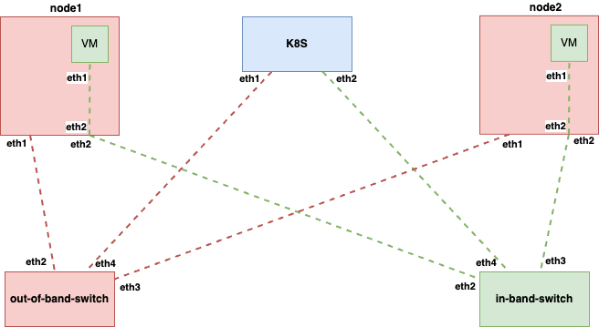
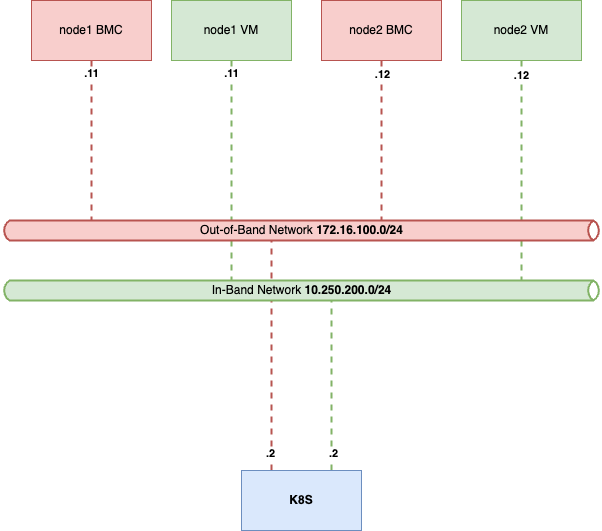

# metal-lab

A standalone [containerlab](https://containerlab.dev/) environment for
developing and exercising [metal-operator](https://github.com/ironcore-dev/metal-operator)
and its supporting stack against BMC-managed servers. The containerlab setup
runs the following services:
* Two `alpine`-based switches that act as bridges for the IB and OOB network
* A `kind`-based Kubernetes cluster that runs:
* * The metal-operator
* * The boot-operator
* * FeDHCP
* * A TFTP server for PXE
* Two [qemu-bmc](https://github.com/simontesar/qemu-bmc)-based server nodes

The environment supports booting via PXE and httpboot.

# Architecture
## Wiring


## Network


## Usage
```shell
# Deploy and run all services
$ make deploy metal-operator-deploy-wait boot-operator-deploy-wait fedhcp-deploy-wait tftp-deploy-wait
…
# Inspect the architecture
$  containerlab inspect
07:25:31 INFO Parsing & checking topology file=infra.clab.yaml
╭─────────────────────────────────────┬──────────────────────┬───────────┬───────────────────────╮
│                 Name                │      Kind/Image      │   State   │     IPv4/6 Address    │
├─────────────────────────────────────┼──────────────────────┼───────────┼───────────────────────┤
│ k8s-control-plane                   │ ext-container        │ running   │ 172.18.0.2            │
│                                     │ kindest/node:v1.35.0 │           │ fc00:f853:ccd:e793::2 │
├─────────────────────────────────────┼──────────────────────┼───────────┼───────────────────────┤
│ clab-metal-operator-test-ib-switch  │ linux                │ running   │ 172.30.30.3           │
│                                     │ alpine:latest        │           │ N/A                   │
├─────────────────────────────────────┼──────────────────────┼───────────┼───────────────────────┤
│ clab-metal-operator-test-node1      │ linux                │ running   │ 172.30.30.2           │
│                                     │ qemu-bmc:latest      │ (healthy) │ N/A                   │
├─────────────────────────────────────┼──────────────────────┼───────────┼───────────────────────┤
│ clab-metal-operator-test-node2      │ linux                │ running   │ 172.30.30.4           │
│                                     │ qemu-bmc:latest      │ (healthy) │ N/A                   │
├─────────────────────────────────────┼──────────────────────┼───────────┼───────────────────────┤
│ clab-metal-operator-test-oob-switch │ linux                │ running   │ 172.30.30.5           │
│                                     │ alpine:latest        │           │ N/A                   │
├─────────────────────────────────────┼──────────────────────┼───────────┼───────────────────────┤
│ k8s-control-plane                   │ k8s-kind             │ running   │ 172.18.0.2            │
│                                     │ kindest/node:v1.35.0 │           │ fc00:f853:ccd:e793::2 │
╰─────────────────────────────────────┴──────────────────────┴───────────┴───────────────────────╯
```

Once you start a test the machines should boot and their consoles should be accessible at the respective URLs:
* https://localhost:4431/novnc/vnc.html
* https://localhost:4432/novnc/vnc.html

Use the default `admin`/`password` credentials. Note that the "connect" button will not display a screen until the machine is booted.

# Running the metal-operator-test-framework
This repository provides two value files than can be used with the [metal-operator-test-framework](https://github.com/simontesar/metal-operator-test-framework) to run tests against the two qemu-bmc managed Servers. After you cloned the `metal-operator-test-framework`, you'll be able to run the tests like this in the other repository:
```shell
$ export KUBECONFIG=/path/to/metal-lab/kubeconfig.yaml
$ make test-compatibility-b1 COMPATIBILITY_VALUES=/path/to/metal-lab/values-containerlab-node1.yaml CHAINSAW_EXTRA_FLAGS="--pause-on-failure"
```

Tear down the setup and optionally remove the VMs' disks in the lab:
```shell
$ make destroy clean-disks
…
```

## Caveats
* HTTPBOOT is disabled because the boot image generated here in `metalprobe-image` is not exported in a format compatible with the `httpbootconfig`-controller of the metal-operator. There are efforts upstream in the `metal-operator` to build a `metalprobe`-image, so this is on hold for now.
* The `metalprobe-image` build is heavily based on the [sanitizer build](https://github.com/ironcore-dev/metal-maintenance-operator/blob/main/.github/workflows/publish-sanitizer.yml) in the `metal-maintenance-operator` and copies tooling from there to download kernel and kernel modules from Debian. It should later be replaced by [kbake](https://github.com/ironcore-dev/kbake) for kernel compilation or an upstream metalprobe image.
