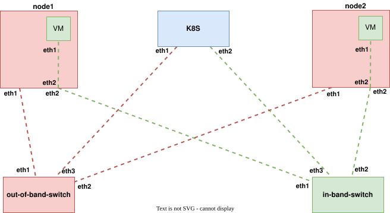
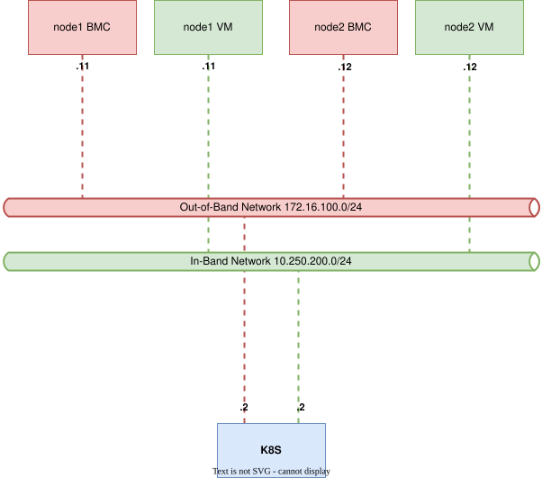

# metal-lab

A standalone environment for running, testing and developing around the [metal-operator](https://github.com/ironcore-dev/metal-operator) and its supporting stack against BMC-managed servers. It runs the following services:
* Two `alpine`-based switches that act as bridges for the in-band and out-of-band network
* A `kind`-based Kubernetes cluster that runs:
  * The metal-operator
  * The boot-operator
  * FeDHCP
  * A TFTP server for PXE
* Two [qemu-bmc](https://github.com/simontesar/qemu-bmc)-based server nodes. `qemu-bmc` implements a virtual BMC in Golang that manages an actual compute resource via QEMU, not a mock. 

See the [Architecture](#architecture) section for more information.

The environment supports booting via PXE and httpboot(see caveats) and includes a minimal discovery [metalprobe boot image](#metalprobe-boot-image) that boots the two virtualised nodes in under ten seconds, allowing a `Server` resource to reach `Available` state in about 30 seconds. It can be used to boot whatever image needed.

## Usage
### Basic workflow
```shell
# Deploy and run all services
$ make deploy metal-operator-deploy-wait boot-operator-deploy-wait fedhcp-deploy-wait tftp-deploy-wait
…

# Create BMC resources for the the nodes
$ make bmc-apply
…
bmc.metal.ironcore.dev/node1 created
bmc.metal.ironcore.dev/node2 created
bmcsecret.metal.ironcore.dev/node1 created
bmcsecret.metal.ironcore.dev/node2 created

# Watch the progress on K8S-level
$ kc get server -w
NAME             SYSTEMUUID                             MANUFACTURER   MODEL                            MEMORY   POWERSTATE   STATE       AGE
node1-system-0   11111111-1111-1111-1111-111111111111   QEMU           Standard PC (Q35 + ICH9, 2009)   4Gi      On           Discovery   4s
node2-system-0   22222222-2222-2222-2222-222222222222   QEMU           Standard PC (Q35 + ICH9, 2009)   4Gi      On           Discovery   4s
…
node1-system-0   11111111-1111-1111-1111-111111111111   QEMU           Standard PC (Q35 + ICH9, 2009)   4Gi      On           Available   22s
node2-system-0   22222222-2222-2222-2222-222222222222   QEMU           Standard PC (Q35 + ICH9, 2009)   4Gi      On           Available   22s
```

### Serial console
Watch the serial console of a node (heavily trimmed output):

<details>

```
$ make node1-console
docker exec -it clab-metal-operator-test-node1 bash -c ' \
        exec 3<>/dev/tcp/localhost/9002; \
        trap "kill 0" EXIT; \
        cat <&3 & \
        cat >&3 \
'
BdsDxe: failed to load Boot0001 "UEFI QEMU DVD-ROM QM00005 " from PciRoot(0x0)/Pci(0x1F,0x2)/Sata(0x2,0xFFFF,0x0): Not Found
BdsDxe: failed to load Boot0002 "UEFI Misc Device" from PciRoot(0x0)/Pci(0x3,0x0): Not Found

>>Start PXE over IPv4.
  Station IP address is 10.250.200.10

  Server IP address is 10.250.200.2
  NBP filename is snponly.efi
  NBP filesize is 296960 Bytes
 Downloading NBP file...

  NBP file downloaded successfully.
BdsDxe: loading Boot0003 "UEFI PXEv4 (MAC:52540005FFDB)" from PciRoot(0x0)/Pci(0x2,0x0)/MAC(52540005FFDB,0x1)/IPv4(0.0.0.0,0x0,DHCP,0.0.0.0,0.0.0.0,0.0.0.0)
BdsDxe: starting Boot0003 "UEFI PXEv4 (MAC:52540005FFDB)" from PciRoot(0x0)/Pci(0x2,0x0)/MAC(52540005FFDB,0x1)/IPv4(0.0.0.0,0x0,DHCP,0.0.0.0,0.0.0.0,0.0.0.0)
iPXE initialising devices...
autoexec.ipxe... Not found (https://ipxe.org/2d12618e)
/autoexec.ipxe... Not found (https://ipxe.org/2d12618e)


iPXE 2.0.0+ (g3ca79) -- Open Source Network Boot Firmware -- https://ipxe.org
Features: DNS HTTP HTTPS iSCSI TFTP VLAN AoE EFI Menu

net0: 52:54:00:05:ff:db using SNP on SNP-0000:00:02.0 (Ethernet) [open]
  [Link:up, TX:1 TXE:1 RX:3 RXE:1]
  [TXE: 1 x "Network unreachable (https://ipxe.org/28086090)"]
  [RXE: 1 x "The socket is not connected (https://ipxe.org/380f6093)"]
Configuring (net0 52:54:00:05:ff:db)...... ok
net0: 10.250.200.10/255.255.255.0 gw 10.250.200.2
net0: fe80::5054:ff:fe05:ffdb/64
Next server: 10.250.200.2
Filename: http://10.250.200.2:30082/ipxe/
http://10.250.200.2:30082/ipxe/... ok
 : 124 bytes [script]
http://10.250.200.2:30082/ipxe/11111111-1111-1111-1111-111111111111... ok
Loading kernel...
http://10.250.200.2:30082/image... ok
Loading initrd...
http://10.250.200.2:30082/image... ok 
Booting...
[    0.000000] Linux version 7.1.0 (kbake@kbake) (gcc (Ubuntu 15.2.0-16ubuntu1) 15.2.0, GNU ld (GNU Binutils for Ubuntu) 2.46) #1 SMP PREEMPT_DYNAMIC @0
[    0.000000] Command line: image initrd=initrd ip=any ignition.firstboot=1 ignition.config.url=http://10.250.200.2:30082/ignition/11111111-1111-1111-1111-111111111111 ignition.platform.id=metal console=ttyS0,115200 console=tty0 console=ttyAMA0 earlyprintk=ttyS0,115200 consoleblank=0
…
[    3.432702] Run /init as init process
2026/08/21 05:29:56 Welcome to u-root!
                              _
   _   _      _ __ ___   ___ | |_
  | | | |____| '__/ _ \ / _ \| __|
  | |_| |____| | | (_) | (_) | |_
   \__,_|    |_|  \___/ \___/ \__|

init: 2026/08/21 05:29:56 Setting console log level to 5...
[    3.456044] cgroup: Unknown subsys name 'memory'
[    3.456044] cgroup: Unknown subsys name 'memory'
[    3.463359] cgroup: Unknown subsys name 'cpuset'
[    3.463359] cgroup: Unknown subsys name 'cpuset'
2026/08/21 05:29:56 INFO acpi: watching for power button events device=/dev/input/event0
2026/08/21 05:29:56 INFO dhcp: sending requests interfaces=[eth0]
2026/08/21 05:29:56 Bringing up interface eth0...
2026/08/21 05:29:56 Attempting to get DHCPv4 lease on eth0
2026/08/21 05:29:57 Attempting to get DHCPv6 lease on eth0
2026/08/21 05:29:58 Got DHCPv4 lease on eth0: DHCPv4 Message
  opcode: BootReply
  hwtype: Ethernet
  hopcount: 0
  transaction ID: 0x6a4a316a
  num seconds: 0
  flags: Unicast (0x00)
  client IP: 0.0.0.0
  your IP: 10.250.200.10
  server IP: 10.250.200.2
  gateway IP: 0.0.0.0
  client MAC: 52:54:00:05:ff:db
  server hostname: 
  bootfile name: 
  options:
    Subnet Mask: ffffff00
    Router: 10.250.200.2
    Domain Name Server: 1.1.1.1, 8.8.8.8
    IP Addresses Lease Time: 24h0m0s
    DHCP Message Type: ACK
    Server Identifier: 10.250.200.2
2026/08/21 05:29:58 INFO configured DHCP
2026/08/21 05:29:58 INFO starting metalprobe args="[--registry-url=http://10.250.200.2:30000 --server-uuid=11111111-1111-1111-1111-111111111111]"
2026-08-21T05:29:58Z    INFO    setup   starting registry agent
2026-08-21T05:29:58Z    INFO    setup   Initializing probe agent
…
2026-08-21T05:29:58Z    INFO    setup   Registering server
2026-08-21T05:29:58Z    INFO    setup   Server registered
2026-08-21T05:29:58Z    INFO    setup   Server registered       {"uuid": "11111111-1111-1111-1111-111111111111"}
2026/08/21 05:29:58 INFO acpi: power button pressed, powering off
[    5.701396] reboot: Power down
[    5.701396] reboot: Power down
```

</details>

Once you start a test the machines should boot and their consoles should be accessible at the respective NoVNC URLs:
* https://localhost:4431/novnc/vnc.html
* https://localhost:4432/novnc/vnc.html

Use the default `admin`/`password` credentials. Note that the "connect" button will not display a screen until the machine is booted.

## Metalprobe boot image
The metalprobe subdirectory implements building a uroot-based operating system image used as `--probe-os-image` in this setup. Instead of starting a full-fledged system like Gardenlinux and running containerd to execute `metalprobe`, it embeds the `metalprobe` binary in its initramfs and executes it via a small Go-binary used as init/PID1 that implements supporting functions like DHCP and ACPI. The image build in the pipeline uses [kbake](https://github.com/ironcore-dev/kbake) and [uroot](https://github.com/u-root/u-root) but the artifact is available publicly as `ghcr.io/simontesar/metal-lab/metalprobe:master`.

## Running the metal-operator-test-framework
This repository provides two value files than can be used with the [metal-operator-test-framework](https://github.com/simontesar/metal-operator-test-framework) to run tests against the two qemu-bmc managed Servers. After you cloned the `metal-operator-test-framework`, you'll be able to run the tests like this in the other repository:
```shell
$ export KUBECONFIG=/path/to/metal-lab/kubeconfig.yaml
$ make test-compatibility-b1 COMPATIBILITY_VALUES=/path/to/metal-lab/values-containerlab-node1.yaml CHAINSAW_EXTRA_FLAGS="--pause-on-failure"
```

Tear down the setup and optionally remove the VMs' disks in the lab:
```shell
$ make destroy clean-disks
…
```

## Architecture
### Wiring


### Network


## Caveats
* HTTPBOOT is disabled because the boot image generated here in `metalprobe-image` is not exported in a format compatible with the `httpbootconfig`-controller of the metal-operator. There are efforts upstream in the `metal-operator` to build a `metalprobe`-image, so this is on hold for now.
* The `metalprobe-image` build is heavily based on the [sanitizer build](https://github.com/ironcore-dev/metal-maintenance-operator/blob/main/.github/workflows/publish-sanitizer.yml) in the `metal-maintenance-operator` and copies tooling from there to download kernel and kernel modules from Debian. It should later be replaced by [kbake](https://github.com/ironcore-dev/kbake) for kernel compilation or an upstream metalprobe image.
